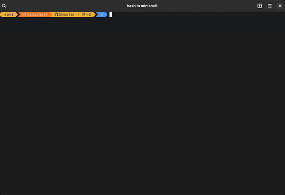

# minishell

## Overview

**minishell** is a small, custom shell implementation written in C. The goal of this project is to recreate a simple command-line shell, mimicking the behavior of bash, with support for command parsing, environment variables, and execution of both built-in and external commands.

This project was developed as part of the curriculum at 42 School.


---

## Features

- **Prompt Display:** Shows a customizable prompt and waits for user input.
- **Command Parsing:** Handles commands, arguments, and quotes.
- **Built-in Commands:** Implements several built-in commands, such as:
  - `echo`
  - `cd`
  - `pwd`
  - `export`
  - `unset`
  - `env`
  - `exit`
- **Executing Binaries:** Runs external programs found in the system `$PATH`.
- **Pipes and Redirections:**
  - Supports pipes (`|`)
  - Redirects input (`<`), output (`>`), and appends (`>>`)
- **Environment Variables:** Expands `$VARNAME` and manages the shell environment.
- **Signal Handling:** Responsive to `Ctrl+C` and `Ctrl+D` (SIGINT, EOF).
- **Error Handling:** Graceful error messages for invalid input or execution errors.

---

## Getting Started

### Prerequisites

- GCC or Clang compiler
- GNU Make
- A Unix-like OS (Linux, macOS)

### Building

Clone the repository and run `make`:

```sh
git clone https://github.com/xrierac/minishell.git
cd minishell
make
```

### Running

```sh
./minishell
```

---

## Usage

You can use minishell like a regular shell:

```sh
$ echo Hello, World!
Hello, World!

$ cd /tmp
$ pwd
/tmp

$ export MYVAR=42
$ echo $MYVAR
42

$ ls -l | grep minishell > out.txt
```

---

## Project Structure

- `src/` — Main source code
- `include/` — Header files
- `Makefile` — Build instructions

---

## Limitations

- No support for advanced bash features (e.g., job control, wildcards/globbing).
- Only mandatory built-ins and minimal error recovery.
- Designed for learning and demonstration purposes.

---

## Authors

- [xrierac](https://github.com/xrierac)
- [tcampbel22](https://github.com/tcampbel22) (contributor)

---
